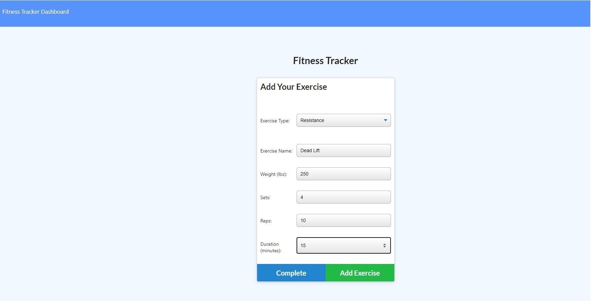

# Workout Tracker 
   
### Table of Contents
* [Description](#Description)
* [Installation](#Installation)
* [Usage](#Usage)
* [License](#License)
* [Contribution](#Contribution)
* [Questions](#Questions)
---

***

***

***
   
### Description 
Thanks for checking out my project! This is a full-stack workout tracking application using node.js, MongoDB, and Express. This application will allow you to establish, track, and visualize different workouts. Each workout allows the addition of many exercises and comes complete with an array of graphs and charts to help see the progress you are making.
   
---
   
### Installation 
To view this project, you can simply navigate to the deployed link {here}, or you can clone this repo and do the following: Ensure MongoDB is installed. run npm i to install all dependencies for the project, then run the script npm start and navigate to the provided address.
   
---
   
### Usage 
When opening the project you will be greeted with a summary of your latest workout. You are provided with the options of continuing the most recent workout, or begining a new one. After making youre selection, you are able to fill in the details of your exercieses. Once you have submitted all of your exercises, you can return to the home page. On the navigation bar you can travel to the dashboard page which displays several graphs and charts containing data from your workouts from the last seven days.
   
---
   
### License 
This project is covered under the MIT license

---
   
### Contribution 
If you wish to contribute to this project, submit any revisions via a pull request.
   
---
   
   
### Questions 

[brendonstahl97](https://github.com/brendonstahl97)

brendonstahl97@gmail.com
   
---